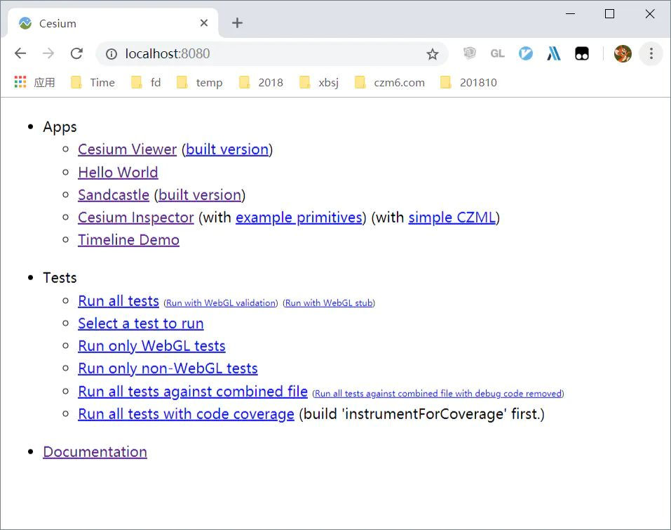
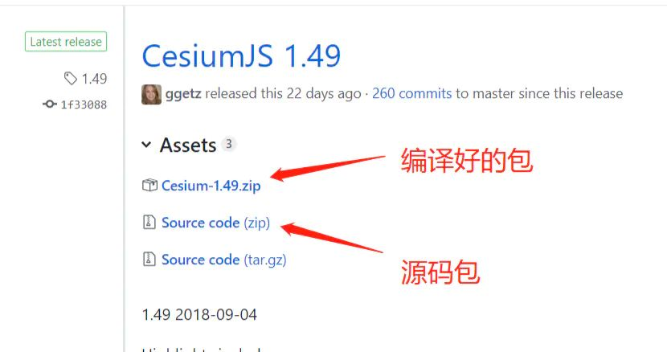

参考资料：
- https://www.cnblogs.com/cesium1/p/10062900.html
- https://www.jianshu.com/p/5f1b56a8a507

## 常见问题

1.  使用源码运行时，默认影像地图加载不出来，可在底图部件(baseLayerPicker)选择一个能打开的就好。

## Cesium 命令总结

### 1 npm start

该命令是启动 Cesium 自己写的一个 http 服务，不是打包命令。  
执行该命令以后，就可以启动服务了，端口号强制为 8080。这个时候可以在浏览器中输入 localhost:8080，效果如下：

- 如果 8080 端口被占用，可以手动换个端口号运行，执行下面的命令：

```
node server.js --port 8081
```

- npm start 命令启动的服务只能在本机查看 ，如果想在局域网内其他机器上观看，可以运行以下命令来搞定：

```
npm run startPublic
```

### 2 npm run build

Cesium 的 npm run build 命令，和其他一些开源库有差别。大部分项目执行 npm run build 命令的意思，一般都是打包生成一个 dist 文件夹，并且把编译压缩优化（生产环境下）的 js 放进去。  
但是 Cesium 却是在 Source 目录下生成了一个 Cesium.js 文件.这个 Cesium.js 文件并不是真正意义上对外输出（生产环境下）的 js 文件，仅仅是把 Cesium 源码中一千两百多个 js 文件做了一下引用。这个 Cesium.js 也就相当于一个索引。

### 3 npm run minifyRelease

这个命令会把 Source 目录下所有的 js 文件打包放到 Build/Cesium/目录下，并且生成一个真正的供生产环境下来使用的 Cesium.js 文件。

```
function minifyRelease() {
    return combineJavaScript({
        removePragmas: true,
        optimizer: 'uglify2',
        outputDirectory: path.join('Build', 'Cesium')
    });
}

gulp.task('minifyRelease', gulp.series('build', minifyRelease));

```

- outputDirectory 选项中可以看到，Cesium 把压缩优化后的 Cesium.js 文件放在了 Build/Cesium/目录下。
- optimizer 选项则表示 js 代码如何压缩优化，Cesium 使用的是 uglify2。
- removePragmas 选项是用来删除源码中的调试信息的。查看 Cesium 源码时，有时会发现源码中有大量的 includeStart 开头的注释，这里面大多是调试信息，removePragmas 设置为 true，相当于来删除 includeStart 和 includeEnd 之间的 js 语句。

```
    //>>includeStart('debug', pragmas.debug);
    if (this.minificationFilter !== TextureMinificationFilter.NEAREST &&
        this.minificationFilter !== TextureMinificationFilter.LINEAR) {
        throw new DeveloperError('ImageryLayer minification filter must be NEAREST or LINEAR');
    }
    //>>includeEnd('debug');
```

### 4 npm run minify

这个命令会压缩优化 js 代码，但是不会去掉调试信息。

```
gulp.task('minify', gulp.series('build', function() {
    return combineJavaScript({
        removePragmas : false,
        optimizer : 'uglify2',
        outputDirectory : path.join('Build', 'Cesium')
    });
}));
```

### 5 npm run combine

这个命令则是既不压缩优化，也不去掉调试信息。相当于生成具备调试信息的 js 文件。

```
function combine() {
    var outputDirectory = path.join('Build', 'CesiumUnminified');
    return combineJavaScript({
        removePragmas: false,
        optimizer: 'none',
        outputDirectory: outputDirectory
    });
}

gulp.task('combine', gulp.series('build', combine))
```

### 6 npm run combineRelease

这个命令相当于不进行压缩优化，但是去掉了调试信息。

```
function combineRelease() {
    var outputDirectory = path.join('Build', 'CesiumUnminified');
    return combineJavaScript({
        removePragmas: true,
        optimizer: 'none',
        outputDirectory: outputDirectory
    });
}

gulp.task('combineRelease', gulp.series('build', combineRelease));
```

### 7 npm run release

npm run release 命令则相当于 combine、minifyRelease、generateDocumentation 三个命令的集合。他会同时做了三件事：

1. 在 Build/CesiumUnminified 目录下生成调试版的 Cesium.js 文件；
2. 在 Build/Cesium 目录下生成压缩优化好的(生产环境下）的 Cesium.js 文件；
3. 并且还生成了 Cesium 的 api 文档，文档放在 Build/Documentation 目录下。

```
gulp.task('release', gulp.series('build', combine, minifyRelease, generateDocumentation));
```

### 8 Development 分组

npm run build 和 npm run release 命令都会生成 Apps/Sandcastle/gallery/gallery-index.js 文件，这个文件是用来管理 Cesium 的示例目录的。  
然而后者生成的 gallery-index.js 文件会去掉 develop 分组。所以实际情况是，执行了 npm run release 命令以后，Development 分组就会消失。如果希望再次看到，就再次执行一下 npm run build 命令即可.

### 9 编译包和源码包的区别

Cesium 官方在 github 中会同时提供两个版本的 zip 包，头一个是 Cesium 事先打包编译好的，这个 zip 包里面会有 Build 目录。  
在自己的项目中直接拿来引用 Build/Cesium/Cesium.js 就好。但是在这个 zip 包里面是看不到 Cesium 示例中的 development 分组的， 而且也不能执行 npm run build 进行编译（部分编译文件被移除）。

如果希望看到 development 分组示例，或者修改 Cesium 源码的话，就只能用第二个 zip 包了。这个 zip 包里面只有源码，需要自行打包。

