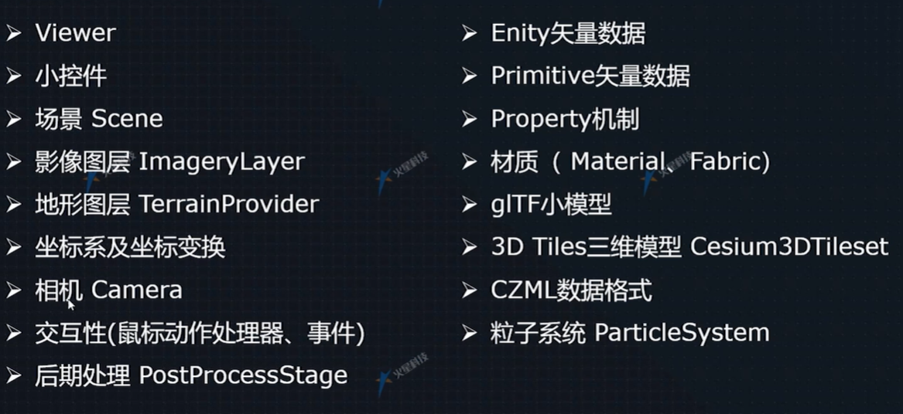

#

cesium 基本内容：

Viewer
小控件
场景Scene
影像图层ImageryLayer
地形图层TerrainProvider
坐标系及坐标转换
相机Camera
交互性（鼠标处理、事件）
后期处理（PostProcessStage）

Entity
Primitive
Property
材质（Material、Fabric）
gltf模型
3d Tiles三维模型（Cesium3DTileset）
粒子系统（ParticleSystem）
CZML数据格式