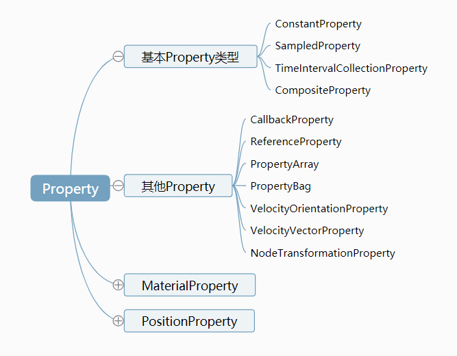
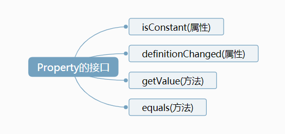

参考资料：  
https://www.cnblogs.com/cesium1/p/10062955.html

# Property

Property 分类：


Property 是所有 Property 类型的虚基类。它定义了以下接口：


- getValue 是一个方法，用来获取某个时间点的特定属性值。它有两个参数：第一个是 time，用来传递一个时间点；第二个是 result，用来存储属性值，当然也可以是 undefined。这个 result 是 Cesium 的 scratch 机制，主要是用来避免频繁创建和销毁对象而导致内存碎片。Cesium 就是通过调用 getValue 类似的一些函数来感知 Property 的变化的，当然这个方法我们在外部也是可以使用的。

- isConstant 用来判断该属性是否会随时间变化，是一个布尔值。Cesium 会通过这个变量来决定是否需要在场景更新的每一帧中都获取该属性的数值，从而来更新三维场景中的物体。如果 isConstant 为 true，则只会获取一次数值，除非 definitionChanged 事件被触发。

- definitionChanged 是一个事件，可以通过该事件，来监听该 Property 自身所发生的变化，比如数值发生修改。

- equals 是一个方法，用来检测属性值是否相等

## 基本 Property 类型

### SampledProperty

A Property whose value is interpolated for a given time from the provided set of samples and specified interpolation algorithm and degree.  
该属性的值在给定时间内从所提供的一组样本和指定的插值算法和次数中进行插值

### TimeIntervalCollectionProperty

该 Property 用来指定各个具体的时间段的属性值，每个时间段内的属性值是恒定的，并不会发生变化，除非已经进入到下一个时间段。拿创建的盒子示例来说，表现出来的特点就是盒子尺寸的变化时跳跃式的

### CompositeProperty

CompositeProperty 的意思是组合的 Property，可以把多种不同类型的 ConstantProperty、SampleProperty、TimeIntervalCollectionProperty 等 Property 组合在一起来操作。比如前一个时间段需要线性运动，后一段时间再跳跃式运动。
function change_composit() {

      // 1 sampledProperty
        var sampledProperty = new Cesium.SampledProperty(Cesium.Cartesian3);
        sampledProperty.addSample(...);


        // 2 ticProperty
        var ticProperty = new Cesium.TimeIntervalCollectionProperty();
        ticProperty.intervals.addInterval(...);


        // 3 compositeProperty
        var compositeProperty = new Cesium.CompositeProperty();
        compositeProperty.intervals.addInterval(
          Cesium.TimeInterval.fromIso8601({
            iso8601: "2019-01-01T00:00:00.00Z/2019-01-02T00:00:00.00Z",
            data: sampledProperty,
          })
        );
        compositeProperty.intervals.addInterval(
          Cesium.TimeInterval.fromIso8601({
            iso8601: "2019-01-02T00:00:00.00Z/2019-01-03T00:00:00.00Z",
            isStartIncluded: false,
            isStopIncluded: false,
            data: ticProperty,
          })
        );

        // 4 设置position
        blueBox.box.dimensions = compositeProperty;

}

### ConstantProperty

最常用的 Property，如

```
blueBox.box.dimensions = new Cesium.Cartesian3(400000.0, 300000.0, 200000.0);
```

以上代码貌似没有使用 ConstantProperty，实际上他是等同于：

```
blueBox.box.dimensions = new ConstantProperty(new Cesium.Cartesian3(400000.0, 300000.0, 200000.0));
```

ConstantProperty 的 Constant 的意思并**不是说这个 Property 不可改变**，而是说它**不会随时间发生变化**。

举个例子，我们可以通过 property.getValue(viewer.clock.currentTime) 方法来获取某个时间点 property 的属性值。

- 如果 property 是 SampleProperty 或者 TimeIntervalCollectionProperty 的话，不同的时间点，可能 getValue 出不同的数值。
- 但是如果这个 property 是 ConstantProperty，那么无论什么时间（getValue 的第一个参数不起作用），最后返回的数值都是一样的。

- 不会随时间变化，并**不代表不可改变**。ConstantProperty 还有一个 setValue 的方法，开发者可以通过调用它，来在适当的时候改变 property 的值。

代码如下：

```
blueBox.box.dimensions.setValue(new Cesium.Cartesian3(400000.0, 300000.0, 700000.0));
```

需要注意的是，虽然最终效果一样，但是以下两种写法的意义是不一样的。

```
// 创建一个新的ConstantProperty
blueBox.box.dimensions = new Cesium.Cartesian3(400000.0, 300000.0, 200000.0);

//修改原有的ConstantProperty的值
blueBox.box.dimensions.setValue(new Cesium.Cartesian3(400000.0, 300000.0, 700000.0));
```

## PositionProperty

PositionProperty 和 Property 一样，是一个虚类，并不能直接实例化，他扩展了 Property 的接口，增加了 referenceFrame，同时只能用来表示 position,包含以下子类：

- CompositePositionProperty
- ConstantPositionProperty
- SampledPositionProperty
- TimeIntervalCollectionPositionProperty

referenceFrame 是用来表示 position 的参考架。目前 Cesium 有以下两种参考架。

```
ReferenceFrame :
Constants for identifying well-known reference frames(用于识别已知参考系的常数).


- FIXED	Number	The fixed frame.
- INERTIAL	Number	The inertial frame.
```

## MaterialProperty

- MaterialProperty 也是一个虚基类，派生类有：
- CheckerboardMaterialProperty
- ColorMaterialProperty
- CompositeMaterialProperty
- GridMaterialProperty
- ImageMaterialProperty
- MaterialProperty
- PolylineArrowMaterialProperty
- PolylineDashMaterialProperty
- PolylineGlowMaterialProperty
- PolylineOutlineMaterialProperty
- StripeMaterialProperty

## CallbackProperty

CallbackProperty 是自由度最高的一种 Property，让用户通过自定义，回调函数，来返回需要的值。回调函数中，用户可以使用 time 来给定 value，也可以以自己的方式给给定.

## ReferenceProperty

该 Property 可以直接链接到别的对象的 Property 上，相当于引用，省得自己构建了。比如这里我创建了一个红色的盒子 redBox，希望它和之前的蓝色盒子一起变大.

```
var collection = viewer.entities;
redBox.box.dimensions = new Cesium.ReferenceProperty(collection, blueBox.id, ['box', 'dimensions']);
```
