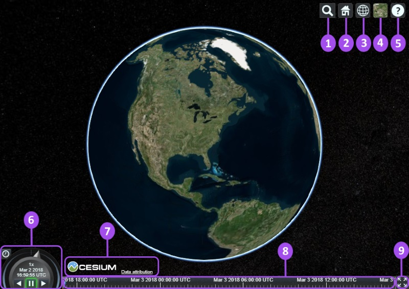
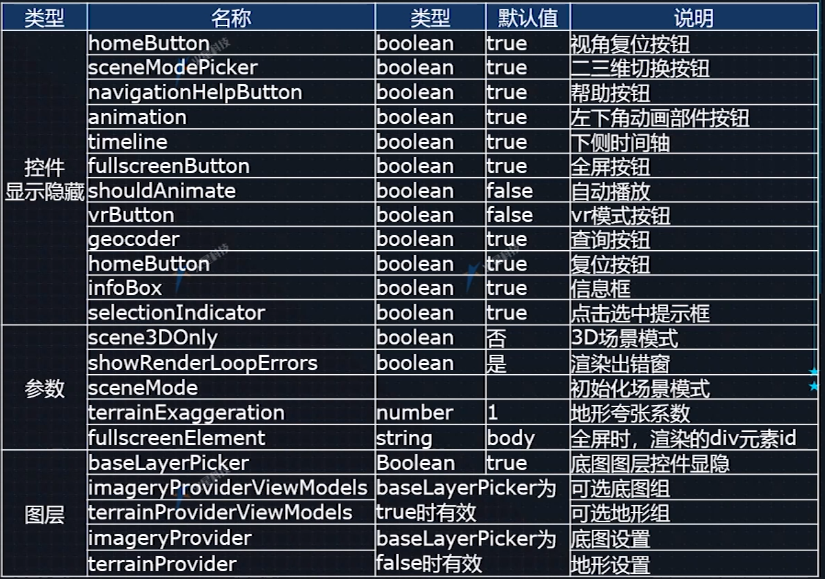

## Viewer 的组件

- 1. Geocoder 地名搜索 : 地名搜索工具，相机飞行到查询地点. 默认使用 Bing Maps 数据.
- 2. HomeButton 默认视图 : 视图复位，回到默认视图.
- 3. SceneModePicker 场景模式 : 切换模式 3D, 2D 或 2.5D (Columbus View).
- 4. BaseLayerPicker 基础图层 : 选择影像或地形图层.
- 5. NavigationHelpButton 帮助 : 帮助，提供默认相机控制方法.
- 6. Animation 动画 : 控制动画播放速度.
- 7. CreditsDisplay 鸣谢 : 显示数据归属.
- 8. timeline 时间线 : 指示当前时间，允许用户跳到指定时间.
- 9. FullscreenButton 全屏 : 全屏.



## Viewer 的参数





## 简洁的CesiumWidget

``` 
var widget = new Cesium.CesiumWidget('cesiumContainer');

```

## 版权信息去除

```
// css 方式去除
.cesium-widget-credits              /!* 去掉logo信息 *!/
    {
        display: none;
    }
   
// js 方式去除     
 widget._creditContainer.querySelector(".cesium-widget-credits").style.display = "none"; //去掉版权信息  

```


Viewer
小控件
场景Scene
影像图层ImageryLayer
地形图层TerrainProvider
坐标系及坐标转换
相机Camera
交互性（鼠标处理、事件）
后期处理（PostProcessStage）

Entity
Primitive
Property
材质（Material、Fabric）
gltf模型
3d Tiles三维模型（Cesium3DTileset）
粒子系统（ParticleSystem）
CZML数据格式


