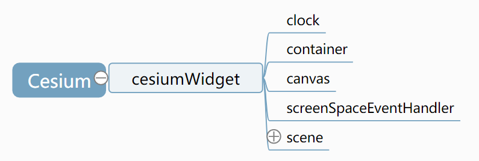

##  核心类CesiumWidget

CesiumWidget内部创建的对象主要有以下几个部分，如图所示:

CesiumWidget:

- clock用来记录时间，三维场景需要进行动态展示，需要通过时间来确定某一帧的绘制内容。 
- container则是构造函数的参数，也就是传入的div。 
- canvas则是在container上构建的Canvas类的对象，可以据此获取WebGL绘制的画笔。 
- screenSpaceEventHandler则是对Canvas对象上各种鼠标的交互事件的封装，方便传递给三维场景。三维场景干之后可以据此改变相机姿态等。 
- scene则承载着整个三维场景中的对象。

## 场景 Scene 

Scene中有一些内置的图元对象：
- globe（地球）  Globe  
       -- imageryLayers : ImageryLayerCollection  
       -- terrainProvider : TerrainProvider  
- skyBox（天空盒）  SkyBox
- skyAtmosphere(大气层)   SkyAtmosphere
- sun（太阳）  Sun
- sunBloom     Boolean
- sunColor  Cartesian3
- moon（月亮） Moon
- backgroundColor   Color
- primitives
- groundPrimitives

 

scene.backgroundColor = Cesium.Color.BLACK;
scene.skyBox.show = false;

scene.debugShowFramePerSecond = true;// 查看性能 
