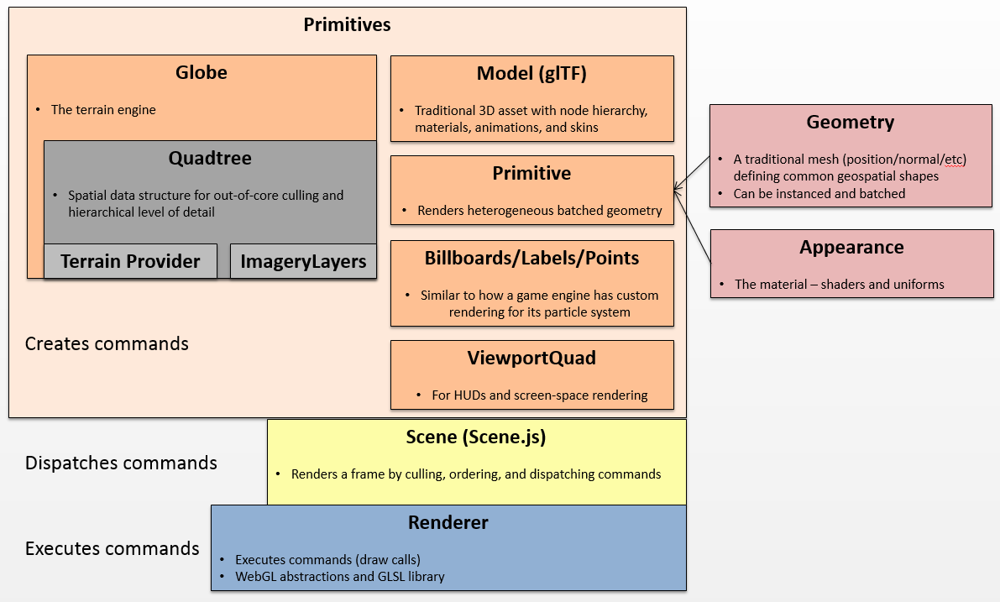
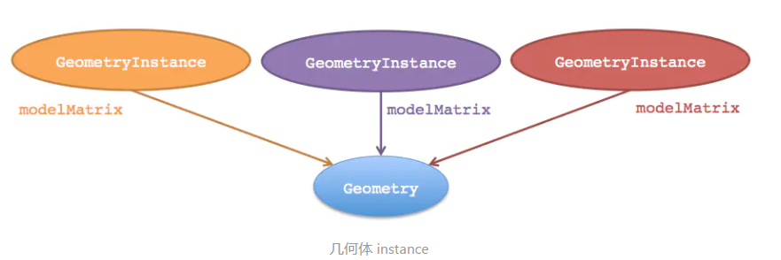
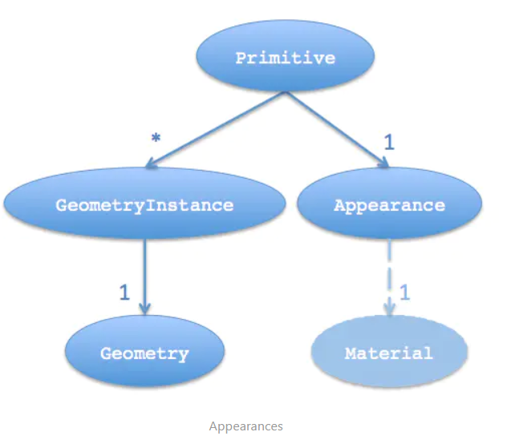

primitives 总体结构：




viewer.entities : EntityCollection


### EntityCollection


- add(entity) → Entity
- getById(id) → Entity
- contains(entity) → Boolean
- remove(entity) → Boolean
- removeAll() 
- removeById(id) → Boolean


### Cesium.Entity(options)
options: 
- id : String	 
- name : String	 
- availability : TimeIntervalCollection	 
- show : Boolean 
- description : Property	 
- position : PositionProperty(The interface for all Property objects that define a world location as a Cartesian3 with an associated ReferenceFrame)	 
- orientation : Property	 
- viewFrom : Property	 
- parent : Entity	 
- billboard : BillboardGraphics  广告牌
- box : BoxGraphics              盒子
- corridor : CorridorGraphics	 通道
- cylinder : CylinderGraphics	 圆柱
- ellipse : EllipseGraphics	     椭圆
- ellipsoid : EllipsoidGraphics  椭球体
- label : LabelGraphics	         标签
- model : ModelGraphics	         模型
- tileset : Cesium3DTilesetGraphics	 3dTiles模型
- path : PathGraphics	         路径
- plane : PlaneGraphics	         平板
- point : PointGraphics	         点
- polygon : PolygonGraphics	     面
- polyline : PolylineGraphics	 线 
- properties : PropertyBag	 
- polylineVolume : PolylineVolumeGraphics	 折线体
- rectangle : RectangleGraphics	 矩形
- wall : WallGraphics            墙体


scene.primitives: PrimitiveCollection


### PrimitiveCollection


### PointPrimitiveCollection(options)

options:
- modelMatrix: Matrix4， Matrix4.IDENTITY	，变换矩阵
- debugShowBoundingVolume: Boolean	，默认false	optionalFor debugging only.  
- blendOption: BlendOption	，默认BlendOption.OPAQUE_AND_TRANSLUCENT


### GeometryInstance
多个instance可以引用同一个几何体（ Geometry），而每个instance可以有不同的偏移矩阵（modelMatrix）。这样，我们就只需要计算一次几何体（计算顶点等）而多次使用它。



更新每个instance的属性
即便是已经添加到图元里，每个instance的一些属性也可以修改，包括：

Color : ColorGeometryInstanceAttribute 决定了几何体颜色。不过图元应该设置一个 PerInstanceColorAppearance外观。
Show :布尔变量决定instance是否可见，对任意instance都有效。

### Appearances（外观）

几何体定义了结构。图元的另一个关键属性是appearance，决定图元的着色，也就说每个像素是如何上色的。   
一个图元可以有若干个几何体instance，但是只能有一个appearance属性。根据appearance类型不同，一个appearance可能有一个 material 属性，材质属性决定了大体的着色。      
 



### Cesium.PointPrimitive()   

created and rendered using a PointPrimitiveCollection. 不使用new 创建


Appearance 外观：

Appearance(接口)：
  
EllipsoidSurfaceAppearance
MaterialAppearance
PerInstanceColorAppearance
PolylineColorAppearance
PolylineMaterialAppearance

矩形： 西南东北


```
var greenLine = viewer.entities.add({
    polyline : {
        positions : [startPosition, endPosition],
        width : 5,
        material : Cesium.Color.SPRINGGREEN
    }
});
 
var polylines = scene.primitives.add(new Cesium.PolylineCollection());
var polyline = polylines.add({
    positions : Cesium.PolylinePipeline.generateCartesianArc({
        positions : [startPosition, endPosition]
    }),
    material : Cesium.Material.fromType('Color', {
        color : Cesium.Color.SPRINGGREEN
    }),
    width: 5
});

```


把线条贴到3dtiles上需要用到两个属性：clampToGround和classificationType。

clampToGround属性用来表示该线段要贴地。1.54版以后贴地中的地字同时指代地形和3dtiles数据。

还有一个属性classificationType，则用来描述是否只贴地形（ClassificationType.TERRAIN），或者只贴3dtiles数据（ClassificationType.CESIUM_3D_TILE），或者二者都贴（ClassificationType.BOTH）。默认情况下是二者都贴。
 
链接：https://www.jianshu.com/p/aab4a0bb0d0e
 