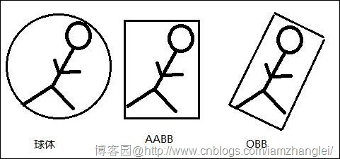

# 数据

### dae 格式

是一种 3D 模型文件格式，一般用于多个图形程序之间交换数字数据，AutoDesk 专有并在 COLLADA（COLLAborative Design Activity）基础上改进创建的 XML 框架的文件格式。

### obj 格式

Obj 文件是 Alias Wavefront 公司为它的一套基于工作站的 3D 建模和动画软件 Advanced Visualizer 开发的一种标准 3D 模型文件格式，很适合用于 3D 文件模型之间的互导，也可以通过 Maya 读写。  
OBJ 是一种文本文件，可以直接用写字板打开进行查看和编辑修改。不包含动画、材质特性、贴图路径、粒子等信息。

### gltf

一种三维模型数据格式，可以减少 3D 格式中与渲染无关的冗余数据并且在更加适合 OpenGL 簇加载的一种 3D 文件格式。它的提出，也是在 3D 工业和媒体发展的工程中，对 3D 格式统一的需要。  
glb 是 gltf 数据二进制组织形式。

### 3DTiles

3DTiles 是为海量的异构三维地理空间数据集所设计的一个开放规范，该规范适用于各种常见的地理数据，如三维模型数据、点云数据、二维矢量数据等，  
3DTiles 的主要目的是针对大规模的异构数据源提高其加载速度和渲染性能。3DTiles 的实施方法是为海量数据加载添加一个快速索引和数据集的整体性描述，  
从而减少渲染循环中需要处理的实体数据量，实现海量数据的加载效率。3DTiles 不是依赖于如缩放等级的 2D 结构，而是基于 LOD 模式的几何误差和可调像素误差，  
它允许在同一视角下建立多个“缩放等级”来优化性能和视觉效果。

### cmpt

3DTiles 的模型切片文件格式中的一种，是一种复合格式，可以同时包含 b3dm、i3dm、pnts 格式的数据文件。

### gdb 格式

ESRI 公司定义的一种文件地理数据库，是一种在文件夹中保存的各种类型的 GIS 数据集的集合。每个数据集都是磁盘上的一个单独文件，每个数据集的大小可以达到 1TB，  
对于超大型影像数据集，还可将 1 TB 限值提高到 256 TB。  
该数据库可以跨平台使用，还可以以只读的压缩格式存储数据以降低存储要求。

### GeoJSON

GeoJSON 是一种对地理数据结构进行编码的格式，其语法规范符合 JSON 格式，只不过对其名称进行了规范，专用于表示地理信息。

### TopoJSON

TopoJSON 是 GeoJSON 按拓扑学编码后的扩展形式，是由 D3 的作者 Mike Bostock 制定的。相比 GeoJSON 直接使用 Polygon、Point 之类的几何体来表示图形的方法，  
TopoJSON 中的每一个几何体都是通过将共享边整合后组成的。

### Tiff 格式

Tiff 是标签图像文件格式（Tagged Image File Format）的缩写。这是一种灵活的位图文件格式，通过在文件头中包含“标签”，它能够在一个文件中处理多幅图像和数据。  
标签能够表明图像的几何尺寸，图像数据的排列顺序以及图像压缩选项等元数据信息。Tiff 文件可以包含基于矢量的裁剪区域（剪切或者构成主体图像的轮廓）。  
Tiff 文件的标签具有一定的扩展性，通过在数据中加载一系列地理信息标签（投影信息，空间参考，原点坐标，波段数，像元大小等），就形成了 GeoTiff。

### GeoTIFF

GeoTIFF 作为 TIFF 的一种扩展，在 TIFF 的基础上定义了一些 GeoTag（地理标签），用来对各种坐标系统、椭球基准、投影信息等进行定义和存储，使图像数据和地理数据存储在同一图像文件中。

### DOM

DOM 是数字正射影像图（Digital Orthophoto Map）的英文缩写，是对航空（或航天）像片进行数字微分纠正和镶嵌，按一定图幅范围裁剪生成的数字正射影像集。
它是同时具有地图几何精度和影像特征的图像。DOM 具有精度高、信息丰富、直观逼真、获取快捷等优点，可作为地图分析背景控制信息，  
也可从中提取自然资源和社会经济发展的历史信息或最新信息,为防治灾害和公共设施建设规划等应用提供可靠依据；还可从中提取和派生新的信息，实现地图的修测更新。  
评价其它数据的精度、现实性和完整性都很优良。

### DEM

DEM 是数字高程模型（Digital Elevation Model）的英文缩写，是通过有限的地形高程数据实现对地面地形的数字化模拟（即地形表面形态的数字化表达），  
它是用一组有序数值阵列形式表示地面高程的一种实体地面模型，是数字地形模型(Digital Terrain Model，简称 DTM)的一个分支，其它各种地形特征值均可由此派生。  
DEM 的数据组织表达形式有多种，常用的有规则举行网格和不规则三角网。

## glTF 规范

https://github.com/KhronosGroup/glTF
https://github.com/KhronosGroup/glTF-Tutorials/blob/master/gltfTutorial/README.md（中文：https://zhuanlan.zhihu.com/p/65264050） 
https://github.com/KhronosGroup/glTF-Tutorials/tree/master/gltfTutorial

### 3d-tiles 规范

https://github.com/CesiumGS/3d-tiles

dae 转 gltf：
https://github.com/KhronosGroup/COLLADA2GLTF

obj 转 gltf：
https://github.com/CesiumGS/obj2gltf

gltf 内部优化
https://github.com/CesiumGS/gltf-pipeline

nginx：

#地图数据
location /mapdata {
include nginx_cors;
root D:\\;
index index.html index.htm

    expires 30d;

}

## 3D Tiles

### 引言(Introduction)

3D Tiles 是用于流式传输和渲染海量地理 3D 数据而设计的一种格式，如摄影测量、3D 建筑物、BIM/CAD、Instanced Features 实例要素和点云数据。它定义了一个分层的数据结构和提供渲染内容的瓦片格式集。3D Tiles 不对内容的可视化定义明确的规则，客户端可以采用合适的方式可视化 3D Tiles 数据。
在 3D Tiles 中，一个 瓦片集（tileset)是一个树形的用于组织空间数据结构的瓦片集合。一个瓦片集（tileset)至少有一个 tileset JSON 文件，该文件包含了 瓦片集（tileset)的元数据和树形瓦片对象，每个瓦片对象可引用下列格式之一的数据：

```
格式                                           用途

批量3D模型（b3dm）                             大型异构3D模型，包括三维建筑物、地形等

实例3D模型（i3dm）                             3D模型实例，如树、风力发电机等

点云（pnts）                                   海量点云

组合数据（cmpt）                               以上不同格式的瓦片组合到一个瓦片中

```

一个瓦片（tile）的内容是 瓦片（tile）格式（如 b3dm、i3dm 等）的一个单独实例，它是一个二进制 blob，该 blob 是包含一个 Feature 表和一个 Batch 表的特定格式的组件。

瓦片（tile）的内容引用一个要素集（a set of features），例如表示建筑物或树的三维模型，或点云中的点。每个要素具有 Feature 表和 Batch 表，
Feature 表中存储位置和外观属性，Batch 表中存储其他具体应用的属性。客户端可以选择在运行时选择特性并检索其属性以进行可视化或者分析。

批量 3D 模型（Batched 3D Model，b3dm）和实例 3D 模型（Instanced 3D Model,i3dm）格式建立在 glTF 上，glTF 是一个为高效传输 3D 内容而设计的开放规范。这些格式的瓦片内容的二进制数据嵌入 gltf 集合，gltf 中包含包含模型几何体和纹理信息，点云格式数据不嵌入 glTF。

瓦片被组织在一棵树中，其中结合了层次细节（HLOD）的概念，以优化空间数据的渲染。每个瓦片都有一个边界体（ bounding volume），边界体是一个完全封闭其内容的空间范围。树具有空间一致性；子瓦片的内容完全位于父瓦片的边界体内。

瓦片集（tileset）可以使用 2 维空间切片策略，类似于栅格和矢量切片策略（如 wmts 或 xyz 切片策略），在服务中预定义几个细节层次（levels of detail）；但是，由于瓦片集（tileset）的内容通常是不一致的，或者可能不容易在二维中组织，因此树可以是具有空间一致性的任何空间数据结构，包括 k-d 树、四叉树、八叉树和网格。

瓦片集可以使用一个 3 维瓦片样式（3D Tiles Style），样式定义要计算的表达式，这些表达式可修改每个要素的显示样式。

### 文件扩展名和 MIME 类型(File extensions and MIME types)

- Tileset 文件使用.json 扩展名和 application/json MIME 类型;
- 瓦片内容文件使用文件类型和 MIME 格式指定其瓦片格式规范（如 i3dm,b3dm);
- Tileset 样式文件使用.json 扩展名和 application/json MIME 类型;
- 文件扩展名是可选的。有效的实现可以忽略它，并通过其头部中的魔法字段来标识内容的格式。

### JSON 编码

3D Tiles 在 JSON 格式化和编码上有以下限制：

- JSON 必须使用不带 BOM（Byte Order Mark，字节顺序标记）的 UTF-8 编码；
- 所有所有的字符（如属性名，枚举仅使用 ASCII 字符集，并且必须以纯文本形式写入；
- JSON 对象中的名称（键）必须是唯一的，即不允许重复的键。

### URI

- 3D Tiles 使用 uri 来引用瓦片内容。这些 uri 可以指向相对外部引用（RFC3986），也可以是在 JSON 中嵌入资源的数据 uri。嵌入式资源使用“data”URI 方案（RFC2397）。
- 当 URI 是相对的时，它总是相对于引用的 tileset JSON 文件。
- 客户端实现需要支持相关的外部引用和嵌入式资源。或者，客户端实现可以支持其他方案（如 http://）。所有 uri 必须有效且可解析。

### 单位

- 距离单位是米
- 所有的角度是弧度

### 坐标系 Coordinate reference system (CRS)

- 3D Tiles 使用右手笛卡尔坐标系，即 x 和 y 的叉积生成 z。3D Tiles 定义局部笛卡尔坐标系得到 z 轴朝上。3D Tiles 的全球坐标系通常位于 WGS 84 地球中心，地球固定（ECEF）参考坐标系（EPSG 4978），但这不是必须的，例如，发电厂可以在其局部坐标系中完全定义，以便在没有地理空间背景的情况下与建模工具一起使用。
- 可以使用瓦片坐标转换将瓦片总局部坐标系转换到其父瓦片的坐标系；
- 区域边界体（region bounding volume）使用地理坐标系统（经度，纬度，高度）指定边界，特别是 EPSG 4979。

### 概念

#### 瓦片（Tiles)

瓦片包含了一个瓦片是否渲染的元数据，可渲染内容的引用，以及子瓦片数组

#### 几何误差（几何误差）

瓦片被结构化成一个包含层次细节级别(HLOD)的树，因此在运行时，客户端实现将需要确定瓦片是否足够详细以用于呈现，以及瓦片的内容是否应该由更高分辨率的子瓦片连续细化。一个具体的应用将考虑最大允许屏幕空间误差(SSE)，以像素为单位的误差。

瓦片的几何误差定义了该瓦片的选择度量。它的值是一个非负数，指定瓦片的源几何图形简化表示的误差(以米为单位)。根瓦片作为源几何图形的最简化版本，将具有最大的几何误差。然后，每一个连续的子瓦片的几何误差将低于它的父层，子瓦片的几何误差等于或接近于 0。

在客户端实现中，如果瓦片被渲染，而它的子瓦片没有被渲染，几何误差与其他屏幕空间参数一起使用——例如瓦片到摄像机的距离、屏幕大小和分辨率——用于计算引入的屏幕空间误差(SSE)。如果引入的 SSE 超过了所允许的最大值，则对该 tile 进行细化，并考虑渲染它的子瓦片。

几何误差是基于诸如点密度、瓦片尺寸(以米为单位)或其他特定于瓦片集的因素而制定的。一般来说，更高的几何误差意味着瓦片将被更积极地细化，子瓦片将被更快地加载和渲染。

#### 细化(Refinement )

细化决定了在较低分辨率父瓦片被渲染，要选择较高分辨率的子瓦片时这一过程。
允许的细化类型是替换(“REPLACE”)和添加(“ADD”)。如果瓦片 进行了“REPLACE”细化，那么子瓦片将代替父瓦片进行呈现，也就是说父瓦片将不再呈现。如果瓦片有“ADD”细化，那么子瓦片会在父瓦片之外呈现。

瓦片集（tileset）可以只使用“REPLACE”细化，或只使用“ADD”细化，或者任何“REPLACE”细化和“ADD”细化的组合。

瓦片集（tileset）根瓦片必须有细化类型;所有其他的瓦片是可选的。当省略时，瓦片继承父瓦片的细化类型。

#### 替换(Replacement)

如果瓦片采用“REPLACE”细化，渲染时只渲染替换了的子瓦片。

#### 添加(Additive)

如果瓦片采用“Additive”细化, 渲染时同时渲染子瓦片和父瓦片。

#### 包围盒(Bounding volumes)

包围盒定义了包围瓦片或瓦片内容的空间范围。
要支持各种数据集（例如规则分割地形、与纬度或经度线不对齐的城市或任意点云）的紧密拟合体积，边界体类型包括定向包围盒、包围盒和由最小和最大纬度、经度和高度定义的地理区域。

- Bounding box: 是一个由 12 个数字组成的数组，它定义了一个在右手 3 轴(x, y, z)笛卡尔坐标系中 z 轴向上的有向包围盒。前三个元素定义了盒子中心的 x、y 和 z 值。接下来的三个元素(带索引 3、4 和 5)定义了 x 轴方向和半长度。接下来的三个元素(索引 6、7 和 8)定义了 y 轴方向和半长。最后三个元素(索引 9、10 和 11)定义 z 轴方向和半长。（即 OBB 包围盒）；

```
"boundingVolume": {
  "box": [
    0,   0,   10,
    100, 0,   0,
    0,   100, 0,
    0,   0,   10
  ]
}
```

- Bounding region: 是一个由六个数字组成的数组，这些数字定义了具有纬度、经度和高度坐标，其坐标顺序为[西，南，东，北，最小高度，最大高度]。 纬度和经度以 EPSG 4979 中定义的 WGS 84 基准为单位，以弧度为单位。高度以米为单位高于(或低于)WGS 84 椭球体。其每条边都和坐标轴平行（即 AABB 包围盒）。

```
"boundingVolume": {
  "region": [
    -1.3197004795898053,
    0.6988582109,
    -1.3196595204101946,
    0.6988897891,
    0,
    20
  ]
}
```

Bounding sphere:sphere 是一个由四个数字组成的数组，用于定义一个边界球体。前三个元素定义了球中心在右手3轴(x, y, z)笛卡尔坐标系中z轴向上的x, y和z值。最后一个元素(索引为3)定义了半径,以米为单位。

```
"boundingVolume": {
  "sphere": [
    0,
    0,
    10,
    141.4214
  ]
}
```

3D Tiles 包围盒：


包围盒补充知识：
https://blog.csdn.net/qq_29579137/article/details/70502591  
https://www.cnblogs.com/lyggqm/p/5386174.html

包围盒:包围体算法是一种求解离散点集最优包围空间的方法。基本思想是用体积稍大且特性简单的几何体（称为包围体）来近似地代替复杂的几何对象。最常见的包围盒算法有:

- 轴对齐包围盒（AABB 包围盒,Axis-aligned bounding box）;
- 包围球（Sphere）;
- 有向包围盒（OBB 包围盒,Oriented bounding box）
- 固定方向凸包 FDH（Fixed directions hulls 或 k-DOP）

包围体类型：


