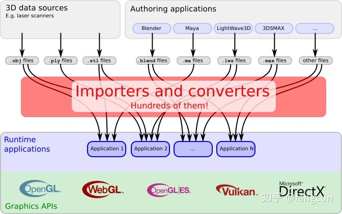

## 1 概述

越来越多的应用程序和服务使用 3D 内容。网上商城为产品提供 3D 预览。博物馆通过 3D 扫描技术将收藏品扫描，允许人们在线参观。城市规划使用 3D 技术来可视化规划结果。教育工作者通过创建可交互的 3D 动画，提升教学质量。

### 1.1 3D 内容管线

3D 内容的来源非常复杂，它们往往还具有不同的文件格式，下面的链接给出了多个不同的应用程序支持的超过 70 种不同的 3D 数据文件格式:
- https://en.wikipedia.org/wiki/List_of_file_formats#3D_graphics 

通常，原生的 3D 数据由 3D 扫描器扫描得到。这些扫描器通常将扫描得到的 3D 数据以 OBJ，PLY 或 STL 格式存储，不包含任何场景结构信息以及 3D 数据如何被渲染的信息。   

更为复杂的 3D 场景数据通常是使用一些创作软件得到的。这些创作软件允许对场景进行编辑，比如对光源、相机和动画进行编辑。创作软件通常以自己的方式来存储这些可以编辑的 3D 场景数据。比如 Blender 将它的场景数据存储为.blend 文件，LightWave3D 将它的场景数据存储为 .lws 文件，3ds Max 将它的场景数据存储为 .max 文件，Maya 将它的场景数据存储为 .ma 文件。  

为了渲染来源不同的 3D 内容，应用程序需要能够读取这些个数不同的 3D 数据文件。为了进行渲染，场景数据和 3D 几何数据需要转换为图形 API 可以接受的形式，从而可以被传输到显卡上进行渲染。通常，如下图所示，应用程序为此需要编写导入程序、加载程序。        

## 1.2 glTF:一个 3D 场景数据格式

glTF 格式的目标是为 3D 内容的数据格式提供统一的标准，方便应用程序读取进行渲染。目前来说已经存在的 3D 数据格式不是没有包含场景数据，就是包含一些只能用于特定创作软件的数据，许多时候，需要对几何数据进行预处理才能直接用于渲染。

目前而言，现存的 3D 数据格式不能够方便地在互联网上进行传输，以及直接高效地进行渲染。glTF 的目标是作为一个中转格式，而不是另一个新的 3D 数据格式：

- 使用 JSON 来描述场景结构，可以方便地被应用程序分析处理。
- 3D 数据以一种可以被大多数图形 API 直接使用的方式进行存储，不需要应用程序进行解码或预处理操作。

现在已经有一些 3D 内容创作软件可以将 3D 场景以 glTF 格式进行存储。一些应用程序也可以直接进行 glTF 场景数据的渲染。图 1a 给出了部分支持 glTF 数据格式的应用程序。如图 1c，glTF 可以作为 3D 内容创作软件和渲染应用程序之间的桥梁。

越来越多的3D内容创作软件开始支持glTF数据格式。对于其它格式的已有的3D数据可以通过下面的工具进行转换： 
- https://github.com/KhronosGroup/glTF#converters

几乎所有的3D内容创作软件都支持导出场景到COLLADA格式，所以，我们可以使用COLLADA2GLTF工具来将场景数据转换为glTF格式。.OBJ文件可以使用obj2gltf进行转换。对于其它数据格式，可以通过深度定制完成到glTF格式的转换。
