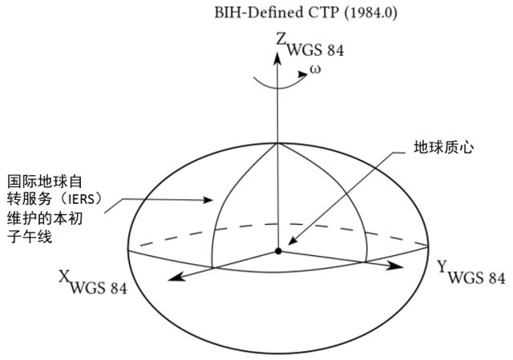

https://www.cnblogs.com/telwanggs/p/11289954.html
https://www.jianshu.com/p/3791c5ea894f
https://blog.csdn.net/qq_34149805/article/details/78393540

## 1 Cesium中的坐标系：
- WGS84经纬度坐标系（没有实际的对象）  
- WGS84弧度坐标系（Cartographic）,地理坐标系下经纬度的弧度表示,通常情况下通过它和WGS84经纬度坐标系之间互转    
- 笛卡尔空间直角坐标系（Cartesian3）   
- 平面坐标系（Cartesian2）   
- 4D笛卡尔坐标系（Cartesian4）    

### 1.1 WGS84坐标系
World Geodetic System 1984，是为GPS全球定位系统使用而建立的坐标系统，坐标原点为**地球质心**，   
其地心空间直角坐标系的**Z轴**指向BIH （国际时间服务机构）1984.O定义的协议地球极（CTP)方向，**X轴**指向BIH 1984.0的零子午面和CTP赤道的交点，Y轴与Z轴、X轴垂直构成右手坐标系。  
我们平常手机上的指南针显示的经纬度就是这个坐标系下当前的坐标，进度范围[-180，180],纬度范围[-90，90]。   
我们都知道Cesium目前支持两种坐标系WGS84和WebMercator，但是在Cesium中**没有实际的对象来描述WGS84坐标**，都是以**弧度**的方式来进行运用的,也就是Cartographic类：      
- new Cesium.Cartographic(longitude, latitude, height)，    
这里的参数也叫longitude、latitude，就是经度和纬度，计算方法：弧度= π/180×经纬度角度。       

### 1.2 笛卡尔空间直角坐标系（Cartesian3）

笛卡尔空间坐标的原点就是椭球的中心，我们在计算机上进行绘图时，不方便使用经纬度直接进行绘图，一般会将坐标系转换为笛卡尔坐标系，使用计算机图形学中的知识进行绘图。           
这里的Cartesian3，new Cesium.Cartesian3(x, y, z)，里面三个分量xyz。       

### 1.3 平面坐标系（Cartesian2)

平面坐标系也就是平面直角坐标系，是一个二维笛卡尔坐标系，与Cartesian3相比少了一个z的分量，new Cesium.Cartesian2(x, y)。        
Cartesian2经常用来描述屏幕坐标系，比如鼠标在电脑屏幕上的点击位置，返回的就是Cartesian2，返回了鼠标点击位置的xy像素点分量。             

## 坐标转换

### 1 经纬度和弧度的转换
经纬度转弧度：var radians = Cesium.Math.toRadians(degrees);
弧度转经纬度：var degrees = Cesium.Math.toDegrees(radians);

### 2 WGS84经纬度坐标和WGS84弧度坐标系（Cartographic）的转换

1.直接转换：通过上面提到的方法，将经纬度转换为弧度后，直接new Cesium.Cartographic(longitude弧度, latitude弧度, height米)
2.间接转换：
- 通过var cartographic= Cesium.Cartographic.fromDegrees(longitude, latitude, height, result) 直接转换，传入的是角度；
- 类似的还有var cartographic= Cesium.Cartographic.fromRadians(longitude, latitude, height, result)方法，传入的是弧度。

### 3 WGS84弧度坐标系坐标系和笛卡尔空间直角坐标系（Cartesian3）的转换

#### 3.1 笛卡尔空间直角坐标系（Cartesian3）转 WGS84弧度坐标系（弧度表示）
 

1.直接转换
 
var cartographic = Cesium.Cartographic.fromCartesian(cartesian, ellipsoid, result) → Cartographic
2、间接转换
var cartographic= Cesium.Ellipsoid.WGS84.cartesianToCartographic(cartesian3)
var cartographics= Cesium.Ellipsoid.WGS84.cartesianArrayToCartographicArray([cartesian1,cartesian2,cartesian3])

#### 3.2 WGS84弧度坐标系（弧度表示）转 笛卡尔空间直角坐标系（Cartesian3）
 
- Cesium.Cartographic.toCartesian(cartographic, ellipsoid, result) → Cartesian3
 
- 从度数转换 
 Cesium.Cartesian3.fromDegrees(longitude, latitude, height, ellipsoid, result) → Cartesian3 
 Cesium.Cartesian3.fromDegreesArray(coordinates, ellipsoid, result) → Array.<Cartesian3>                                  
 coordinates	Array.<Number>		A list of longitude and latitude values. Values alternate [longitude, latitude, longitude, latitude...].                   
- 从弧度转换 
Cesium.Cartesian3.fromRadiansArrayHeights(coordinates, ellipsoid, result) → Array.<Cartesian3>   
Cesium.Cartesian3.fromRadiansArray(coordinates, ellipsoid, result) → Array.<Cartesian3>                       
Cesium.Cartesian3.fromRadians(longitude, latitude, height, ellipsoid, result) → Cartesian3            

- cartographicToCartesian(cartographic, result) → Cartesian3

//Create a Cartographic and determine it's Cartesian representation on a WGS84 ellipsoid.            
var position = new Cesium.Cartographic(Cesium.Math.toRadians(21), Cesium.Math.toRadians(78), 5000);            
var cartesianPosition = Cesium.Ellipsoid.WGS84.cartographicToCartesian(position);   

- cartographicArrayToCartesianArray(cartographics, result) → Array.<Cartesian3>

//Convert an array of Cartographics and determine their Cartesian representation on a WGS84 ellipsoid.
var positions = [new Cesium.Cartographic(Cesium.Math.toRadians(21), Cesium.Math.toRadians(78), 0),
                 new Cesium.Cartographic(Cesium.Math.toRadians(21.321), Cesium.Math.toRadians(78.123), 100),
                 new Cesium.Cartographic(Cesium.Math.toRadians(21.645), Cesium.Math.toRadians(78.456), 250)];
var cartesianPositions = Cesium.Ellipsoid.WGS84.cartographicArrayToCartesianArray(positions);

#### 3.3 平面坐标系（Cartesian2）和笛卡尔空间直角坐标系（Cartesian3）的转换
1 平面坐标系转笛卡尔空间直角坐标系
这里需要说明的是当前的点必须在三维球上，否则返回的是undefined，我们在ScreenSpaceEventHandler回调会取到的坐标都是Cartesian2。
- （1）屏幕坐标转场景WGS84坐标，这里的场景坐标是包含了地形、倾斜、模型的坐标。
转换方法为：var cartesian3= viewer.scene.pickPosition(Cartesian2)，目前IE浏览器不支持深度拾取，所以用不了这个方法。

- （2）屏幕坐标转地表坐标，这里是地球表面的WGS84坐标，包含地形，不包括模型、倾斜摄影表面。
转换方法为：var cartesian3= viewer.scene.globe.pick(viewer.camera.getPickRay(Cartesian2),viewer.scene);

// find intersection of ray through a pixel and the globe
var ray = viewer.camera.getPickRay(windowCoordinates);
var intersection =  viewer.scene.globe.pick(ray, viewer.scene);

- （3）屏幕坐标转椭球面坐标，这里的椭球面坐标是参考椭球的WGS84坐标，不包含地形、模型、倾斜摄影表面。
转换方法为：var cartesian3= viewer.scene.camera.pickEllipsoid(Cartesian2)
          pickEllipsoid(windowPosition, ellipsoid, result) → Cartesian3

- （4）笛卡尔空间直角坐标系转平面坐标系
var cartesian2= Cesium.SceneTransforms.wgs84ToWindowCoordinates(viewer.scene,cartesian3)

// Output the window position of longitude/latitude (0, 0) every time the mouse moves.
var scene = widget.scene;
var ellipsoid = scene.globe.ellipsoid;
var position = Cesium.Cartesian3.fromDegrees(0.0, 0.0);
var handler = new Cesium.ScreenSpaceEventHandler(scene.canvas);
handler.setInputAction(function(movement) {
    console.log(Cesium.SceneTransforms.wgs84ToWindowCoordinates(scene, position));
}, Cesium.ScreenSpaceEventType.MOUSE_MOVE);

